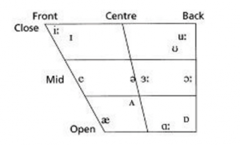

今天口语课上每人读了一句带/ʌ/的句子，结果就我一个人没被挑出来错，真是感觉受宠若惊。Really……

正巧这节课的同桌跟我讨论这个发音问题，所以写一下我通过大一上语音课和大一下口语课的学习对元音的发音问题的总结。

这张图奉为经典！

大概是这样的，英语元音的发音位置在口腔当中的不同位置，每个点都非常精确，揣摩透这个图的话，对英语发音很有帮助，这也是我上大学以后才醒悟的，以前都是按感觉瞎说。

哎，发现也没什么可写的，都在这个图中。

如果想要把/i:/发准确，舌尖需要微微抵下齿龈，做一个微笑的微笑的表情就可以了；/i/的话其实不完全算是短的/i:/，嘴角只需要咧一下就可以了，非常短，甚至有些时候，你用发/e/的方法发这个音效果会特别好，比如bit, pitch这种，这也是这个图把/i/放在了/e/和/i:/中间的原因。

还有一个中间音也比较有趣，就是/ʌ/，其实这个音不是纯粹的小/a/，这个音要吞着发，与/ə/相近，但带点/a/or/æ/的音，就出来了。举例如：under, bug。

大概就这么多，共勉。