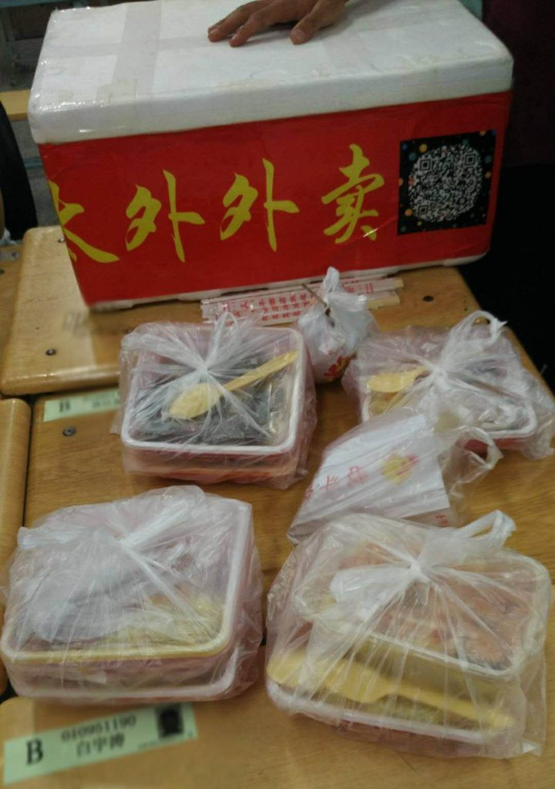

## 一、足彩投资公司

高三那年9月，正是应当紧张学习的时候，不安分的我不知怎么迷上了足彩。2014年，还没有不能线上发售彩票的禁令，可以很方便地在手机APP上购买足彩，一注2元。开始时，我跟着感觉买，似乎还赚了些小钱；后来，我开始通过数学知识研究赔率，自己计算预期收益（当然了，一般足彩预期收益大概稳定在0.9左右，也就是庄家抽水10%）。

后来，可能是发现个人投资风险太大，或是发现了什么不得了的投注方式，我宣布成立了“足彩投资公司”，带领大家“共同致富”。我自己制定了公司章程和分红方式，写在本子上，在班里传看。

起初，大概有十几个同学都在我的“公司”入了股，最多的不超过20元，也有低于1元的，我一丝不苟地把每一笔资金和股东都记录在了本子上，并把每一次投注和收支情况也记下来，作为公示，定期向股东们分红，颇有一番非法集资的味道。

慢慢地，足彩投资公司开始声名远扬，经过我的不懈拉拢，股东人数增长到了30人左右，范围遍布好几个班级，慢慢地开始有名起来。足彩业务也一直在运作，有赚有赔，直到后来的某一天，国家要求下架所有线上博彩业务——就这样，我的足彩投资公司也无法再继续运作。

于是，在第二年临近毕业的前夕，给每个股东都准备了一个信封，里面装着本金与分红，以及资金明细和“通知”，这也标志着我的第一次“商业小尝试”正式结束。虽然部分分红是倒贴给股东的，但是这次经历却收获了很多经验。

## 二、太外外卖

2015年6月，那是一个移动支付和外卖还没有在我们这个二线小城普及的时期。那时距离收到BIT的拟录取通知已经过了整整4个月，在这期间，除了出游三次之外，我每天上午去做家教，晚上在一家高考培训学校做助教，时而和同学好友在学校附近一聚，很是充实。但闲不住的我总感觉生活缺少点激情，如果再不趁着这多出的半年时间做一点什么，可就太可惜了。

随着那些年外卖产业在大城市的兴起，我也受到了启发，心生一计——何不利用保送生这个特殊身份，既可以在下课之前采购好食物，又能进入到学校里，为老师同学直接送餐上门呢？

说做就做，我马上着手编写宣传单页

